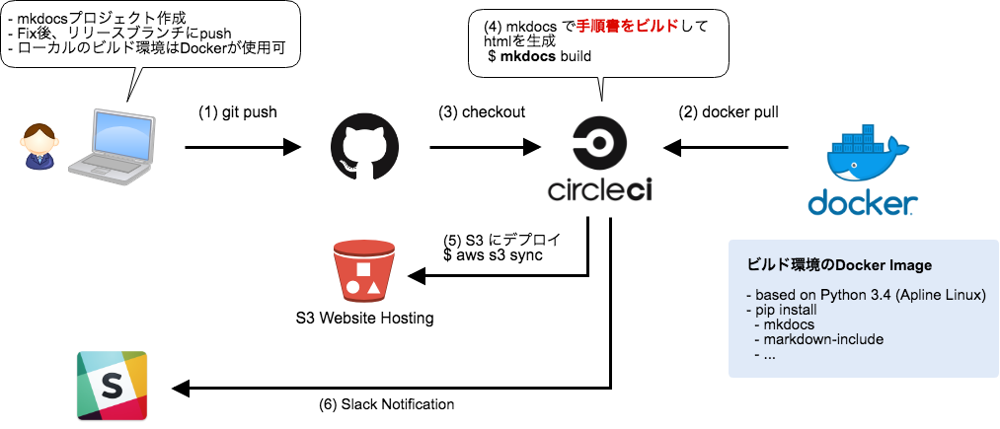

# Excel方眼紙で手順書作るのやめ隊 - AWS/GitHub/CircleCI/mkdocs でドキュメント管理- 
Excelで書かれた手順書をゴニョゴニョするの本当に嫌だなと思ったので、なんとかもうちょっと生産的に仕事が出来ないかと思ってこの記事を書きました。構想の半分は妄想で出来ています。

# はじめに
よりよい手順書改善ライフを過ごすための構成を提案しています。システムの構築やその使い方に関しては今回記載しません。それはまた別の記事にしたいと思います。

Excelドキュメントに苦い思い出をされた方、それなりに多数いらっしゃるのではないでしょうか。Excelベースの手順書、編集作業って基本的に苦痛ですよね。
 
編集時に発生するレイアウト調整とかの（本質的でない）作業は、手順書本体のボリュームが増えるほど増加します。 **高々数行の手順を挿入するために、挿入以降の工程で大幅にレイアウト修正が必要になった...こんな経験、一度はあるのではないでしょうか？このようなことに時間を浪費して生産性を落とすことは、誰もが本意ではないはずです。**

この記事は、そんなExcel方眼紙を脱却して継続的にドキュメントの改善が回せる環境を作るべく、そのプロトタイプとなるネタを書き起こしました。

※残念ながら、本番運用に乗せる話ができたとしたら、CircleCIは（現場的に）外れる気がします。ビルド〜デプロイの流れは、所謂「Code兄弟」と呼ばれるAWSサービスに置き換わることが想定されます。CircleCIを使ったのは、その方が私にとって早く試作できると思ったからで、特にCircleCIにはこだわりません。

# 前提条件

現場の背景が違えば課題やとるべき施策も様々だと思います。なので私の想定する「現場」のことを記載します。

環境は全面的に**AWSで運用されています** 。なのでAWSがNGだとそもそもこの構成は取れません。

ドキュメントの編集者には現場スタッフを想定します。末端の作業者がここには含まれます。作業者の技術レベルは、基本的なPCの知識は持っている（Officeの操作であったりは普通にできる）程度です。

ここで言う手順書は「操作マニュアル」的な位置づけを持つものとします。作業者にシステム/業務に関する前提知識をあまり要求しないタイプという感じです。要は技術力の高くないスタッフがJoinすることを常に想定する、という意図です

また、運用とは「手順書で定められた定常運用」を主業務とする現場を想定しています。障害対応などの非定常運用は想定していません。
最終的には、Excelベース + ファイルサーバーな手順書管理の代替案として、以下の構成を作ってみた、という話に着地します。

## 筆者について
現場の管理者に近い位置づけです。マネージャーよりは下、という感じ。作業の内容はそれなりに把握しています。

手順書のブラッシュアップも含めて、業務効率化・業務改善を行うのが最近の主業務です。

## 構成図

ドキュメンテーションビルドのツールである「mkdocs」を使用しています。
さらにバージョン管理、自動ビルドが可能な環境を実現するためにCIサービスのCircleCIを採用します。

リリース用のブランチにドキュメントがpushされると、CircleCIのコンテナ(mkdocsが仕込んである)上でソースをビルドし、最終的に生成されるhtmlがS3にデプロイされ、リリースが完了します。ついでにSlackへの通知も仕込んでいて、必要に応じてリリースデプロイの「承認」をSlackで通知させることもできます。

構成図からは見えにくい情報ですが、個人的なアピールポイントは以下になります。

- Excelベースからテキスト(markdown)への移行
	- テキストベースのため変更や加筆が容易になり、編集の心理的/物理的負担を軽減
	- VCSのシステム上で変更管理が容易に（バイナリでは変更差分の詳細が見えない）
- ドキュメンテーションビルドシステムを使うことで編集者/作業者双方のニーズを両立
	- 編集者は共通手順を1箇所で管理したい
	- 作業者は1つの作業を1つの手順書で完結させたい
- ビルド環境としてDockerを採用
	- 「誰がやっても同じビルド環境」を提供可能
	- ライブラリのバージョンが古くなっても、当面はビルド可能な環境を維持することが可能。いざという時に延命措置が取れる
- レビュー 〜 リリースまでのプロセスが透明になる
	- レビュー方法がメールベースからプルリク駆動に変わる
		- GitHubを見れば、レビューのステートが誰の目にも明瞭にわかる
	- git pushトリガーでの自動ビルド・デプロイに対応
		- プルリクがmasterにmargeされれば自動的に手順書がリリースされる
		- Webhookなど使えば各作業者への通知も容易
	- CIツールの機能を使って承認機構も導入が可能
- サーバーレス
	- ここで提示する構成は**全てSaaSやフルマネージドサービス**を利用しています。

この辺、アプリ開発では結構普通の話だと思います。これを運用ドキュメントの世界でやってみたら面白いんじゃないか？と思ったのがそもそものきっかけです。

CircleCIは外部サービスなので、現場によっては業務利用に若干ハードルがあるかもしれませんね。そんなときはCodeBuildを始めとする「AWS Code兄弟」を利用することで環境をAWSアカウント内でクローズできます。今回たまたま私がCircleCIを使っただけで、ビルドプロセスを構成する部分は柔軟に変更可能です。

# 手順書を取り巻く環境かくあるべき
**大層なことを書いてますが、あくまで私見です**。ご了承ください。

私自身、運用としての現場経験はまだ浅いです。なのでご意見は歓迎です。

## Excelってどうよ
そもそものスタートが「Excel方眼紙脱却したい」なので、まずは手順書のフォーマットとしてExcelを使うことの是非を述べます。スタンス的に当然ですが、結論はデメリットの方が大きい。「Excelを本来の用途以外に使うんじゃない」って感じです。

### Excelここが素敵
Excel手順書も、別に悪いことばかりではありません。メリットはあると思います。特筆すべきは以下の2点かと。

- ツールの学習コスト
- 単一ファイルでの管理が可能

ドキュメントの継続的なメンテナンスは非常に重要な業務ですが、それを実現するためには日々作業を抱えている現場の作業者の協力が不可欠です。 **作業者が編集者の立場を兼ねる** ことも往々にしてあるのではないでしょうか？

日々作業に終われる現場の作業者が手順書改修を継続的に実施していくためには、どのような環境が必要でしょうか？少なくとも私は、**編集という作業のハードルを低く保つ**ことが重要だと考えます。そのため、どのような現場においても「誰でもある程度は使える」ことが期待できるExcelを使用することは理に適うと思います。

単一ファイルでの管理が可能であることも、メリットとして大きいと思います。運用の規模が大きくなれば、引き継ぎや個別対応の増加などを経て、当然ながら情報の管理は難しくなっていきます。

正しい情報のありかが管理できなくなると、いずれは...

- 新人A:「XX作業の手順書通りにやったけど、うまくいかなくて障害が起きた。どうしてでしょうか」
- ベテランB:「その手順書見せて。...あー、これ古いやつだわ。今の最新はXXXファイルサーバのYYYって場所にあるんだよ」
- 新人A:（知らんがな。。)

とか、

- 新人A:「XX作業の手順書通りにやったけど、うまくいかなくて障害が起きた。どうしてでしょうか」
- ベテランB:「その手順書見せて。...あー、これは汎用のやつ。○○様は個別対応で、その手順はXXXにある」
- 新人A:（知らんがな。。)

的な。（※想像です）

単一ファイルでの管理ができれば、少なくとも「参照してる別手順がリンク切れしてる！」といった騒ぎは未然に防げます。

※単一ファイルでも `XXX手順書_最新版_2_final_20180201` みたいな謎ファイルが乱立する現象とか、防げない事象はあります。

### Excelここがイヤだ
ざっと挙げてみます。

- ちょっとした手順挿入でもレイアウト変更が入ってとにかく手間
	- レイアウト調整にそれなりの工数を使う。誰得事案
	- ↑のような背景があるのでどんどん手順書修正が億劫になる。**心理的にもハードルが上がり、手順書を継続的に改善する文化が廃れがち**になる
- ソースが多重管理になる。共通的な汎用手順が、各作業手順書埋め込みになってしまう
	- 更新の手間が増える
	- 更新漏れのリスクも増える
- 変更履歴の管理が煩雑
	- バイナリなのでGitHubなどに乗せてもメリットが薄い（diff見えない・プレビューできない）
	- 結局Excelの変更履歴機能を使うか、ChangeLog用のシートを用意するかになる
		- そして、往々にして忘れられる
		- 「差分内容の把握と記録」が人力仕事になってしまっている
- 過去の変更履歴、変更経緯をどこで管理する？
	- 現行手順の経緯/Whyを知らなければ、手順そのものの改善はできない
		- 過去の経緯を無視した変更はできない
		- 変更履歴を追える仕組みは業務改善に必要不可欠
	- レビュー履歴を残す機構は外部システム（メール、あるいはチャットなど）に頼る必要がある
		- 未来の担当者からすれば地獄
			- 今いない人間が出している、存在有無すら不確かな過去メールを検索する時の気持ち
			- レビューコメントが口頭でやりとりでもされていたら終了
			- どこまで行っても「口頭のやりとり」がなかったことは証明できない。口伝のみの引き継ぎがあったのでは？という疑念は残る

以上を要約すると、 **「修正作業の煩雑さ」と「履歴の管理」** に集約できるかと思います。「誰でも使えるツール」であることは初期の学習コストを軽減してくれますが、未来のメンテナンスでそのツケを払うタイミングがやってきます。

## 手順書の書き方作法
作業する人と手順を書く人、必ずしも一致することはないと思います。

立場が変わると、「扱いやすい手順書」の見え方は違います。

今の私は編集者の立場に近いですが、以前の私は作業者としての業務が中心でした。なので作業者寄りの立場で書きます。

### 作業者観点

少なくとも、作業者が業務を実施するにあたっては「1つの手順書は1つの場所」に置かれている方が良いでしょう。上記は参照場所に関する心配ごとになりますが、実際作業するシーンにおいてもその点は重要です。

**オペミスを防ぐ観点において、「1個の手順書の流れを順にたどれば、その作業が完結できること」はとても重要だと考えます。** 

作業手順の各工程がハイパーリンクであちこちに飛んで、また戻る...というキュメントは、作業をする上であまり良いフォーマットとは言えないと思います。
このような手順書を使うと、上から下に、順番にやる、という作業の流れを作ることが難しくなります。結果、現在の工程がどこであったか、見失ってしまう確率が上がります。オペミスに直結するリスクになります。

### 編集者観点
一方、ドキュメント編集者の立場では、共通手順は1つのソースにまとめたいと思うものです。更新作業が煩雑になってしまいますし、同じソースが分散すると更新漏れのリスクもあります。共通手順をハイパーリンクで参照するやり方は編集都合として合理的です。 **しかし、それをそのまま手順書に落としてしまうことは、作業者フレンドリーではない** 可能性があります。

## どうしたら良いのか
ちょっと考えてみました。

### Markdownへの移行
手順書フォーマットにはテキストを基本にしたいと考えました。テキストベースとなることにはいくつかの利点があります。

- 編集の手間が減る
	- Excelで味わうようなレイアウト調整は基本的に不要になります
	- 追加手順の挿入や工程順序の入れ替えなどはテキストブロックのコピペでOK
- バージョン管理システムの力を使えるようになる
	- テキストなら過去のdiffも容易にとれる
	- 変更背景などの引き継ぎづらい情報をコミットメッセージやissueに残せる

フォーマットには、それなりの表現力があって覚えるのも簡単な「Markdown」への切り替えを前提に考えていました。他の選択肢としては[Sphinx](http://www.sphinx-doc.org/ja/stable/)がサポートする「Restructured Text(reST)」も選択肢に上がりましたが、個人的にシステムの試作段階でreSTを覚えるのが面倒だったことと、他の編集者にレクチャーしやすいのはどちらかと思った時、markdownに軍配が上がりました。

### ドキュメンテーションビルドシステムの導入

作業者と編集者の間には、一見相容れないニーズがあるように見えます。

- 作業者は、1つの作業手順を流れで追えるような状態であって欲しい
- 編集者は、汎用的な作業工程は1つのソースにまとめて管理したい

双方のニーズを満たすための手段としてはドキュメンテーションビルドシステムの導入が検討できます。代表的なのは[Sphinx](http://www.sphinx-doc.org/ja/stable/)だと思います。

今回の記事でも利用を考えたのですが、結局却下しました。Sphinxは自身を動かすためのサーバーを立てる必要をあり、諸々面倒なだと思ったのが1つ。ドキュメントの記法として採用されているreSTがとっかかりの上でちょっと面倒くさいなと感じたのが1つ、という感じです。

で、Markdownをデフォルトでサポートするものはないかと眺めていた時、良さそうなのは[mkdocs](http://www.mkdocs.org/)かなと思いました。拡張機能の導入が必要となりますが、別ファイルのincludeもサポートされているため、共通手順の一元管理は実現が可能です。

mkdocsはスタンドアロンで動作するので、ドキュメントの生成結果をローカルでも確認することができます。ちょっとした確認はmarkdownエディタのプレビュー機能で、ローカルでのビルドによって最終的なhtmlの見栄えの確認も簡単に行えます。

### GitHub ✕ CircleCI ✕ Docker でビルド〜リリースを自動化

手元の確認が簡単にできるとはいえ、リリース版はどこかに配置する必要があります。デプロイの手段が必要です。

そのあたりの仕組みとして[GitHub](https://github.com/)と[CircleCI](https://circleci.com/)（あとdockerレジストリ）を使います。

mkdocsがインストールされた環境を `docker build` で作成し、Doker HubやAmazon ECRといったdockerレポジトリにpushしておきます。CircleCIで使用するビルド環境にはこれを指定します。

GitHubとCircleCIを連携させ、ブランチへのpushに連動してCircleCIで `mkdocs build` を実行させます。ビルドした結果は `aws s3 sync` を使ってS3バケットにデプロイします。

ドキュメントの作成後、本番へ適用するために以下のステップを踏むことになります。

- `mkdocs build` でhtmlを生成
- 生成されたコンテンツ一式をWebサーバーに配置

今回の構成を使うことで、これらのプロセスを自動化します。デプロイ先であるS3は `Website hosting` という機能を持っており、サーバーの調達なしにWebページのホスティングを可能にします。デプロイコマンドである `aws s3 sync` は `--delete` オプションを使用して差分を考慮したコンテンツアップロードが可能なので、新バージョンで消えたドキュメントなどは勝手にお掃除されます。地味に便利ですね。

またCircleCIではビルド・デプロイのフローに「承認(approval)」を組み込むことができます。手順書ドキュメントの修正でレビューが不要ということはまずありませんので、この機能は有用だと思います。リリースまでのプロセスがレビュー承認まで含めて一目瞭然になるのは良いことだと思います。メールの山からレビュー結果を探すという作業もこのシステムでは必要ないわけです。

この仕組みは一度作ってしまえばそうそう変更が要りません。編集者は作成したmarkdownを `commit` → `push` すれば良いだけです。本番へのデプロイにはプルリクを使います。

# まとめ
今回のシステムでどういうことがしたかったかというと、以下の点になります。

- Excelやめる
- 手順書を簡単に改修できる環境を手に入れる
- 手順書のバージョン管理はそれを得意とするシステムの力を借りる（借りられるようにする）
- リリースまでのプロセスを自動化する

割とやりたいことは実現できたような気がします。ただし課題もあって、まだまだ本番運用には乗せられない状態です。特に気にしているのは以下のポイントです。

## 編集者の負担をもっと下げる
編集者に技術レベルは期待しないと仮定していますので、編集者に求められる技術要素は少ないほうが良いです。

特にgitの使用がハードルになりえます。できればgitは触らせなくても済むようにしたいところ。markdownの記法だけ覚えてしまえばいいような仕組みにしたいのですが、今のところそのへんは今後の課題です。

## Markdownの表現力
実際に手順書を移行していくにあたって、markdownの表現力でどこまでやれるかは未知数です。

本気で運用を考えるなら、Sphinxもきちんと検証してみる必要がありそうです。reSTの表現力は、Sphinx拡張まで含めるとmarkdownのそれよりも優るはず。

## このシステムの引き継ぎどうするの
いくつかの要素が組み合わさる構成なのでちょっと引き継ぎに難儀しそうです。運良く技術者のアサインができれば良いですが、そうならない可能性も想定し得るはずですので・・・。

この話の前提に近い部分を覆す話になりますが、[DocBase](https://docbase.io/)や[Confluence](https://ja.atlassian.com/software/confluence)といったSaaSサービスを利用する、という手も有力だと思います。

# 参考
- [CircleCI - Orchestrating Workflows](https://circleci.com/docs/2.0/workflows/)
- [CircleCI - Configuration reference](https://circleci.com/docs/2.0/configuration-reference/)
- [Qiita - CircleCIのManual ApprovalをSlackへ通知する](https://qiita.com/t2h5/items/94c56570fd17c527305a)