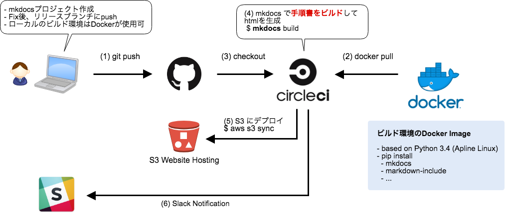

# ci-docs
このドキュメントは[mkdocs.org](http://mkdocs.org)で生成されました。
テーマは "readthedocs" を利用しています。

元ネタの記事は[こちら](https://qiita.com/hassaku_63/items/83daf4dac111f0b5390f)です。

mkdocsで元のQiita記事をビルドすると[こうなります](20180225_qiita_blog.md)。

# 構成図

# Link
- Qiita -  [Excel方眼紙で手順書作るのやめ隊 - AWS/GitHub/CircleCI/mkdocs でドキュメント管理- ](https://qiita.com/hassaku_63/items/83daf4dac111f0b5390f)
- GitHub(ビルド環境) - [ci-docs_build_environment](https://github.com/hassaku63/ci-docs_build_environment)
- GitHub(このWebサイトのソース) - [ci_docs](https://github.com/hassaku63/ci_docs)